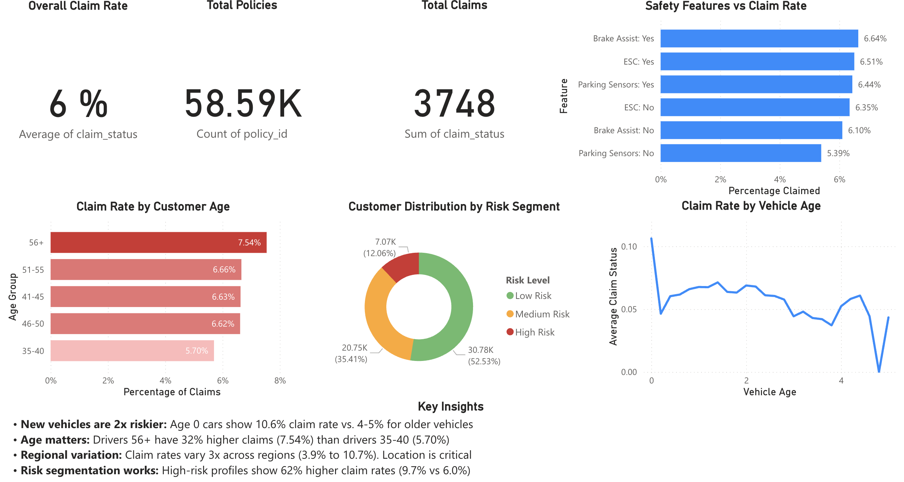

# Insurance Claims Risk Analysis

Analysis of 58K automotive insurance policies to identify risk patterns and support data-driven pricing strategies.

## Dashboard



## Key Findings

- **New vehicles are 2x riskier** - 10.6% claim rate vs 4-5% for older vehicles
- **Age matters** - Drivers 56+ have 32% higher claims than drivers 35-40
- **Regional variation** - Claim rates vary 3x across regions
- **Risk segmentation works** - High-risk profiles show 62% higher claim rates

## Stack

- **Python**: Data Analysis and Cleaning (pandas, numpy)
- **Jupyter Notebooks**: Exploratory Data Analysis
- **Power BI**: Data Visualization and Dashboard
- **Kaggle API**: Dataset sourcing
- **Dataset**: https://www.kaggle.com/datasets/litvinenko630/insurance-claims

## Analyses

1. Customer age groups vs claim rates
2. Regional risk variation analysis
3. Safety features impact assessment
4. Vehicle age vs claim likelihood
5. Customer risk segmentation model

## Project Structure

```
insurance-dashboard/
|-- notebooks/          # Jupyter notebooks for exploration and analysis
|-- data/               # Raw data from Kaggle (not committed to GitHub)
|-- .gitignore
|-- pyproject.toml      # Python dependencies
|-- README.md
```

## Setup

This project uses [uv](https://github.com/astral-sh/uv) for dependency management.

```bash
# Install dependencies
uv sync

# Start Jupyter
uv run jupyter notebook
```

## Dataset

58,592 automotive insurance policies with 41 features including customer demographics, vehicle specifications, and claim status. Source: [Kaggle Insurance Claims Dataset](https://www.kaggle.com/datasets/litvinenko630/insurance-claims)
